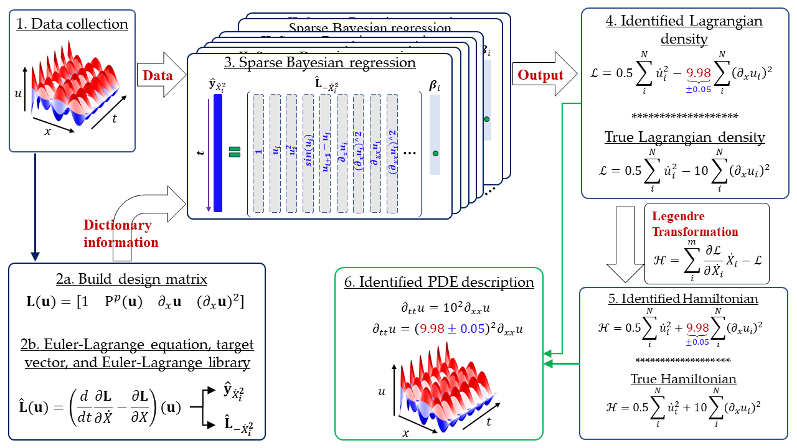

# Bayesian-Lagrangian-Discovery
Bayesian framework for discovering interpretable Lagrangian of dynamical systems from data

## This repository contains the python codes of the paper 
  > + Tapas Tripura and Souvik Chakraborty (2024). A Bayesian framework for discovering interpretable Lagrangian of dynamical systems from data. [Paper](https://arxiv.org/abs/2310.06241)
  > + 

## Files
  + `1) Burgers equation.ipynb` This code is for discovering 1D Burgers' equation.
  + `2) 1-D Heat equation.ipynb` This code is for discovering 1D Heat' equation.
  + `2-D Heat equation.ipynb` This code is for discovering 2D Heat' equation.
  + `3) TwoSolitonKDV .ipynb` This code is for discovering KdV' equation.
  + `4) Kuramoto Sivashinky eqn.ipynb` This code is for discovering 1D KS' equation.
  + `5) Wave equation.ipynb` This code is for discovering 1D Wave' equation
  + `utils_0.py` It contains the useful functions to perform Variational Bayes regression.

## BibTex
If you take help of our codes, please cite us at,
```
@article{tripura2023bayesian,
  title={A Bayesian framework for discovering interpretable Lagrangian of dynamical systems from data},
  author={Tripura, Tapas and Chakraborty, Souvik},
  journal={arXiv preprint arXiv:2310.06241},
  year={2023}
}
```
