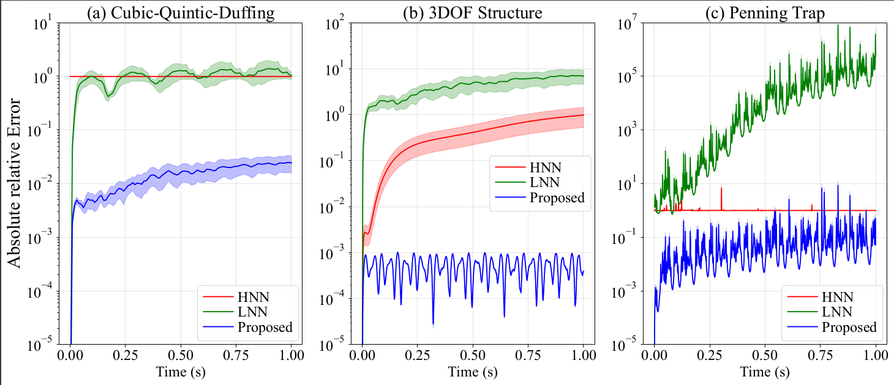

# Bayesian-Lagrangian-Discovery
Bayesian framework for discovering interpretable Lagrangian of dynamical systems from data

## This repository contains the Python codes of the paper 
  > + Tapas Tripura and Souvik Chakraborty (2024). A Bayesian framework for discovering interpretable Lagrangian of dynamical systems from data. [Paper](https://arxiv.org/abs/2310.06241)
  > + Schematic Architecture
  

  > + Comparison with HNN and LNN
    

## Files
```
📂 HNN
  |_📂 experiment-3dof
    |_📄 train_3dof.py    # Train HNN for 3DOF oscillator
  |_📂 experiment-CQD
    |_📄 train_CQD.py     # Train HNN for cubic-quintic-Duffing oscillator
  |_📂 experiment-trap
    |_📄 train_trap.py    # Train HNN for Penning-Trap
  |_📄 analyze-3dof.ipynb   # Predict and analyze the trained HNN model of 3DOF oscillator
  |_📄 analyze-cqd.ipynb    # Predict and analyze the trained HNN model of CQD oscillator
  |_📄 analyze-Trap.ipynb   # Predict and analyze the trained HNN model of Penning-Trap 
📂 LNN
  |_📂 LNN_3DOF
    |_📂 notebooks
      |_📄 Structure_3dof.ipynb    # Train LNN for 3DOF oscillator
  |_📂 LNN_Nonlinear
    |_📂 notebooks
      |_📄 Nonlinear.ipynb         # Train LNN for cubic-quintic-Duffing oscillator
  |_📂 LNN_Trap
    |_📂 notebooks
      |_📄 Structure_trap.ipynb    # Train LNN for Penning-Trap 

📄 `lagrange_Bayes_CQD.py` To discover the Lagrangian of the cubic-quintic-Duffing oscillator.
📄 `lagrange_Bayes_Trap.py` To discover the Lagrangian of the Penning Trap.
📄 `lagrange_Bayes_3DOF.py` To discover the Lagrangian of a 3DOF oscillator.
📄 `lagrange_Bayes_string.py` To discover the Lagrangian of wave equation.
📄 `lagrange_Bayes_beam.py` To discover the Lagrangian of the Euler-Bernoulli beam.
📄 `lagrange_Bayes_Two_Body.py` To discover the Lagrangian of the two-body system.
📄 `utils.py` This code contains useful functions for library construction and sparse Bayesian regression.
📄 `utils_data.py` This code contains useful functions for data generation.
📄 `beam3fun.py` This code contains functions for the Euler-Bernoulli beam simulation.
```
    
## BibTex
Cite us at,
```
@article{tripura2023bayesian,
  title={A Bayesian framework for discovering interpretable Lagrangian of dynamical systems from data},
  author={Tripura, Tapas and Chakraborty, Souvik},
  journal={arXiv preprint arXiv:2310.06241},
  year={2023}
}
```
